# Angkor Quest — Explorer character

A fully rigged, animated voxel explorer for the Angkor Wat game, rebuilt from the
character reference sheets (turnaround, close-up details, colour palette,
expressions, variations, action poses) and scaled to sit correctly in a
real-size Angkor Wat map.

- **`index.html`** — real-scale test level: walk the explorer across the western
  causeway, through the west gopura's doorway and up to the 65 m central tower.
- **`viewer.html`** — character studio: turnaround, expressions, outfits and
  animations on a backdrop that mimics the reference sheet.
- **`studio.html`** — the world kit's asset studio: the landscape, stone and
  props of the component plan's sections 18–20, laid out like their reference
  sheets. `index.html?level=kit` lets you walk among them at true scale. See
  [World kit](#world-kit-sections-1820).

```bash
npm install
npm run dev        # open http://localhost:5173/ (game) and /viewer.html (viewer)
npm run build      # typecheck + production build into dist/
```

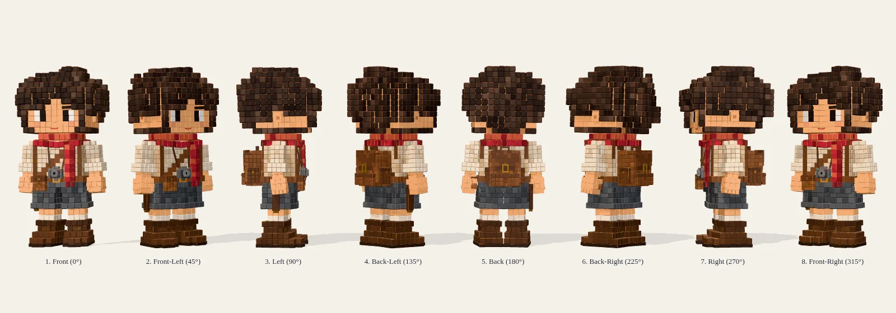

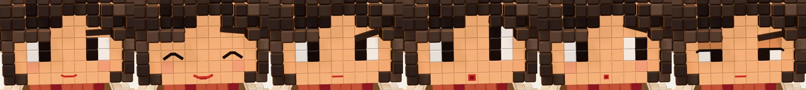

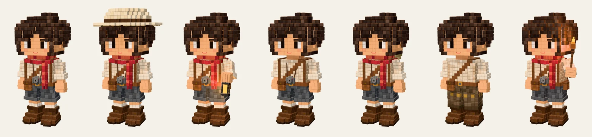

| Western causeway (12 m) | Gopura doorway (3.4 m) |
| --- | --- |
| 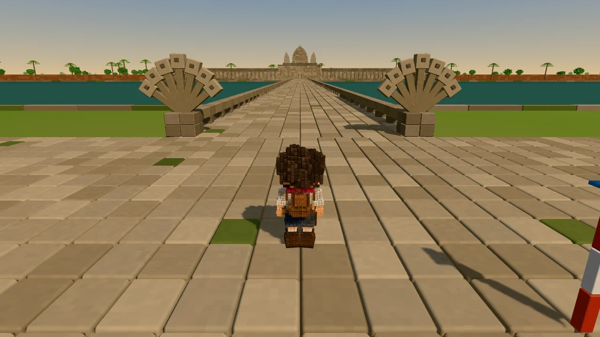 | 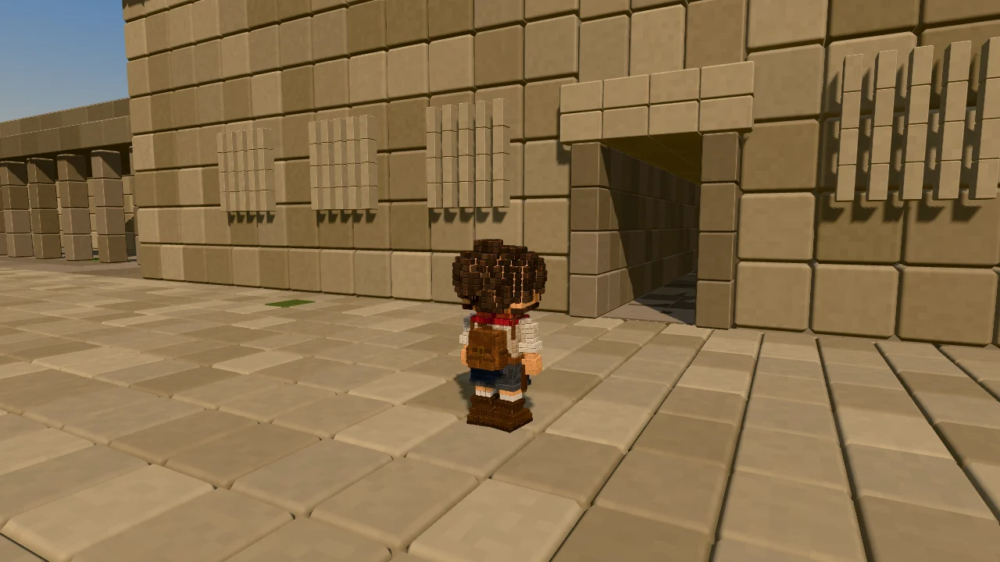 |
| **Overview — the explorer is the dot in the doorway** | **Dusk with the torch** |
| 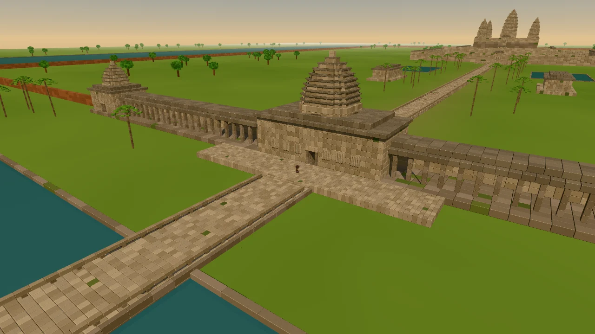 | 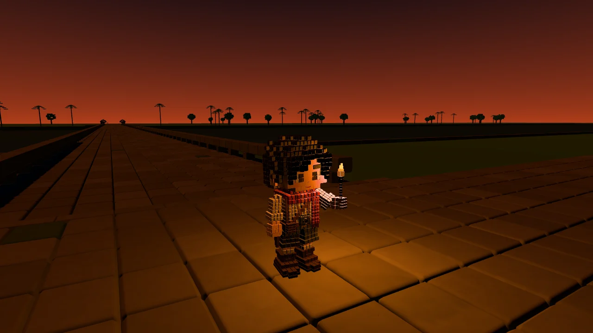 |

## World kit (sections 18–20)

The first components of the temple plan
(`Angkor Wat Voxel Bavel Reconstruction --- Component Plan.md`), built as a
reusable voxel kit from the sheets in `assets/angkor detail/`:

- **§18 landscape**: trees, palms, bushes, a jungle cluster, ground foliage and
  ground tiles.
- **§19 stone**: six sandstone finishes and six kinds of damage.
- **§20 small props**: fragments, fallen blocks, statues, shrines, offerings,
  steps, drains, ponds, leaves, roots and grass.

Sizes are real-world. Each asset records what its sheet said and why it
differs.

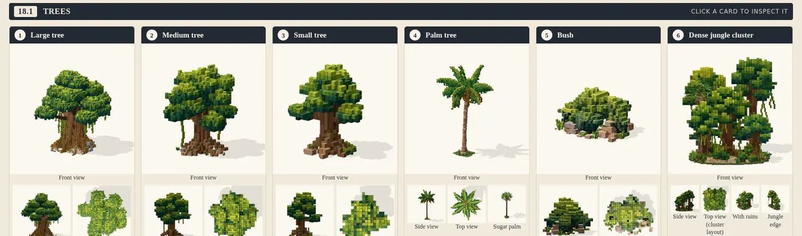
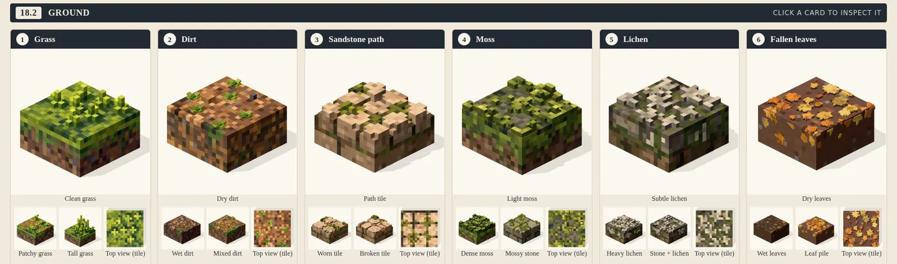
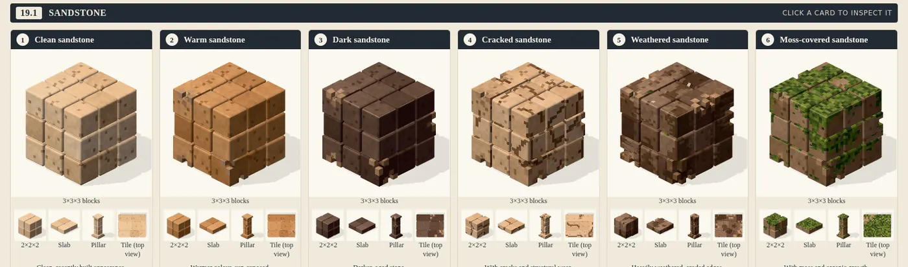
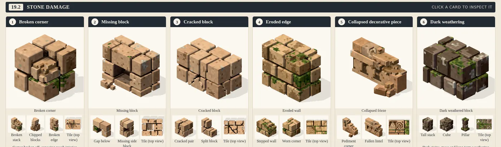
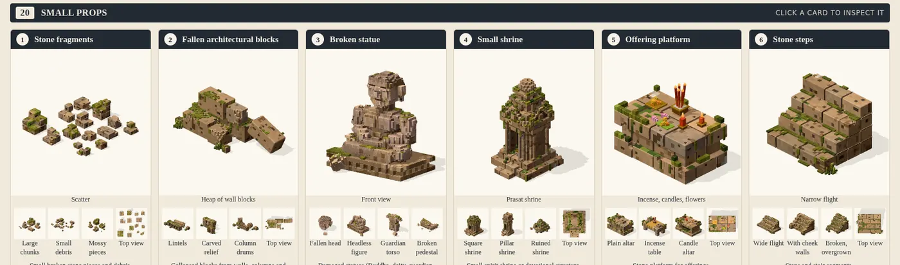

The sheets' environment examples as scenes: a tree by a temple wall, palms
along the causeway, dense jungle, a temple path, a weathered gallery and a shrine
with offerings. They are six of the twelve.

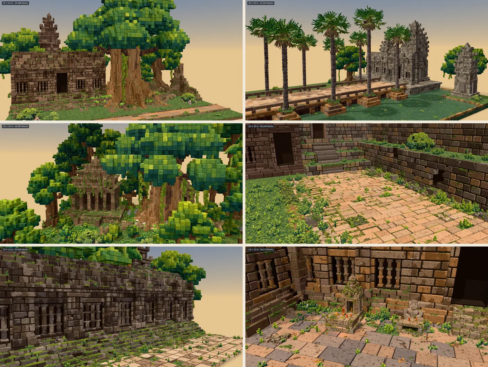

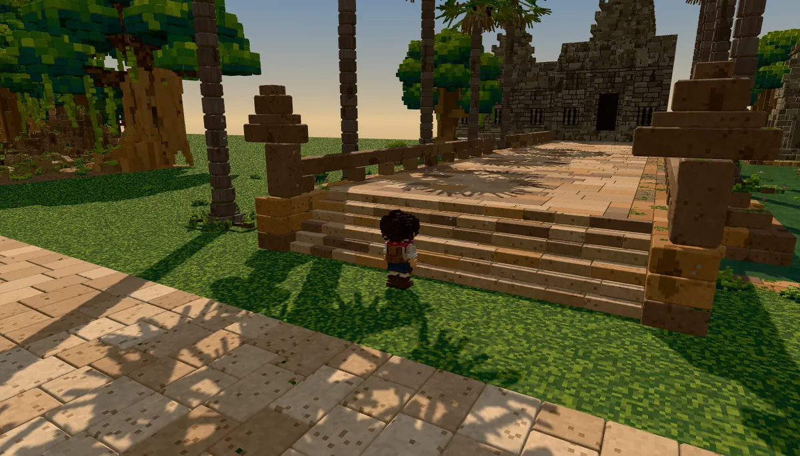

- `studio.html?section=18.1` (`18.2`, `19.1`, `19.2`, `20`) shows a section
  as cards like its sheet, with its environment scenes underneath.
  `?asset=18.1/large-tree` shows one asset beside its sheet crop: every view and
  variant, plus a scale view with the explorer. `?scene=…` opens a diorama.
- `index.html?level=kit` is a walkable specimen garden of every asset, plus the
  dioramas at true scale. Keys `1`–`9` and `[` `]` jump between spots.
- **B** reports a problem from any of these pages. The report names the line of
  the asset module that made each block.

How it's built, the size decisions and how to add assets:
[`docs/world-kit.md`](docs/world-kit.md).

## Scale contract (1 unit = 1 metre)

The Angkor Wat sheets are drawn at real size (complex ≈ 1.5 km × 1.3 km, 190 m
moat, 65 m central tower) and mark the human figure as ≈ 1.7 m, so the explorer
is exactly **1.70 m** tall. All constants live in `src/world/scale.ts`; build the
map against them rather than guessing.

| Thing | Size |
| --- | --- |
| Explorer (sole → hair top) | **1.70 m** (32.4 body units, 1 BU ≈ 5.2 cm) |
| Collision capsule | radius 0.32 m, step-up 0.42 m |
| Walk / run speed | 1.9 m/s / 4.6 m/s (animation cadence is locked to distance) |
| Gopura / gallery doorway | 3.4 m × 1.8 m (≈ 2× the explorer, as on the sheet) |
| Western causeway | 12 m wide |
| Stair riser / tread | 0.25 m / 0.35 m (Bakan stairs 0.3 m / 0.18 m) |
| Central tower | 65 m |
| Sandstone block kit | 0.5–1.5 m tiles |

The character sheet's own "Height ≈ 16 voxels / 6 voxels wide" labels do not
match its renders (the render is ≈ 32 blocks tall with an 11-block face and a
14-block head of hair), so — as requested — those numbers were ignored and the
model was measured off the renders with a grid overlay instead.

## Using the explorer in the map

```ts
import { AngkorExplorer } from './src/character/AngkorExplorer';

const explorer = new AngkorExplorer({ quality: 'medium', outfit: 'default' });
scene.add(explorer.object);            // metres, feet on y = 0, facing +Z

// every frame, from your controller:
explorer.object.position.copy(playerPosition);
explorer.object.rotation.y = playerYaw;
explorer.setMotion(horizontalSpeed, isGrounded, verticalSpeed);
explorer.update(dt);

// on demand:
explorer.play('openDoor');             // interact, lookUp, peek, wave, cheer
explorer.setExpression('surprised');   // neutral, happy, determined, surprised, curious, focused
explorer.setOutfit('withLantern');     // default, withHat, withLantern, withoutScarf,
                                       // explorerGear, templeOutfit, torchBearer
explorer.setOutfit({ hat: true, held: 'torch' });   // or mix individual pieces
```

`src/game/PlayerController.ts` is a complete third-person controller (camera-
relative movement, run, jump, stairs, box collision, wall-aware follow camera)
that works with any `ColliderWorld` of axis-aligned boxes.

## What's in the character

| Sheet panel | Implementation |
| --- | --- |
| Turnaround / proportions | `src/character/skeleton.ts` (joint pivots measured in body units) |
| Colour palette (3.2) | `src/character/palette.ts` — swatches sampled from the sheet, tuned against the renders |
| Face (3.3.1) + expressions (3.4) | `parts/face.ts` — seamless skin, eyes with a white block and a wide two-tone pupil, blush, nose bump, thin smile; six expressions + blinking |
| Hair (3.3.2) | `parts/hair.ts` — procedural: skull shell ∪ rounded cloud, strand displacement; fringe swept over the right eye (hiding that brow) with the forehead showing on the left, sideburns, cheeks and ears clear like the side view |
| Krama scarf (3.3.3) | `parts/scarf.ts` — chunky three-row collar that dips at the front, plaid built from red / maroon / salmon bands, four-band tail with cross stripes and a five-tassel fringe (swings with physics) |
| Shirt, straps (3.3.4) | `parts/torso.ts` |
| Camera (3.3.5–6) | `parts/gear.ts` — chunky octagonal lens ring, red shutter light, brass lugs, neck strap (swings) |
| Backpack (3.3.7) | `parts/gear.ts` — flap, brass buckle, pockets, rivets; bigger trekking pack for "Explorer Gear" |
| Belt & pouches (3.3.8) | `parts/torso.ts` — buckle, pouches with brass snaps, knife sheath |
| Shorts, boots, hands (3.3.9–11) | `parts/limbs.ts` — hemmed shorts, cream socks, cuffed boots; relaxed / holding / pointing fists |
| Materials (3.3.12) | `src/voxel/materials.ts` — per-material bevel radius, warm rim tint, surface grain, seamless face |
| Variations (3.5) | hat, lantern (lit), no scarf, explorer gear, temple sampot, torch (lit) |
| Action poses (3.6) | `src/character/clips.ts` — idle, walk, run, jump/land, open door, peek, hold lantern/torch, look up, interact, wave, cheer |

### How the blocks are drawn

Every block is a rounded cube (`src/voxel`). Parts are authored on their own
grids so the model mixes resolutions like the sheet (big hair/face blocks, a
finer shirt weave, tiny camera parts). Each material family is one
`InstancedMesh`; block sizes ride in the instance matrices and the shader
re-bevels them so every edge keeps the same radius. Rims are painted only on
edges between two exposed faces, so flush neighbours show a soft seam and real
steps catch a warm highlight — the look of the reference renders. Ambient
occlusion and colour jitter are baked per block. The face family is
*seamless*: each block pushes its bevel into covered neighbours, so the face
reads as one smooth surface with only its silhouette rounded, as on the sheet.

Quality levels: `high` (smooth bevels, viewer), `medium` (24-vertex chamfered
blocks, game default), `low` (plain boxes, world LOD beyond ~170 m).

### Animation

`Animator` blends idle / walk / run by speed with the gait phase driven by
distance travelled, layers jump / landing / actions / prop-holding arms, then
plants the lowest sole on the ground (so crouches and strides stay grounded).
The krama tail, camera and lantern are Verlet pendulums that react to movement.

## Reporting bugs and ideas

Press **B** in the game or the viewer (or tap **🐞 Report**). The page freezes;
click what's wrong — a wall block, the explorer's hair, a spot where something
invisible blocks you — write a note in any language and **Save report**. The dev
server writes `feedback/<date>-<slug>/report.md` + `screenshot.jpg`:

- every pick names **the line of code that built it** (e.g. `gateHall` in
  `AngkorScaleWorld.ts` → `WorldBuilder.block`), plus the collider boxes there and
  where they were added — blocks and colliders record their call stack in dev
  builds, mapped back to the `.ts` sources;
- a URL (and an `npm run shots` command) that puts the explorer, camera, outfit,
  lighting and current action back exactly as they were;
- the explorer / camera state, recent console errors, browser and GPU.

Ask Claude to "check the feedback" (push the folder first if Claude runs in the
cloud). See [`feedback/README.md`](feedback/README.md).

## Scripts

- `npm run shots -- name=query …` — headless screenshots of viewer states, e.g.
  `npm run shots -- front="view=0" happy="expr=happy&zoom=head"`; prefix with
  `@page?` for another page (`game="@index.html?shot=1&spawn=1"`).
- `npm run playtest` — headless play test that drives the explorer with real key
  presses: walks through the gopura doorway, runs, hits a wall, climbs the temple
  stairs, jumps and opens a door — then files a bug report and checks it names
  the code that built what was clicked.
- `node scripts/voxel-slices.mjs hair,head` — ASCII front/side projections for
  quick silhouette checks.
- `npm run kitcheck` — builds every world-kit asset variant headlessly and
  reports errors, block budgets and build times;
  `node scripts/kit-sizes.mjs --write` refreshes the size table in
  `docs/world-kit.md`.

## Controls (game)

`WASD` move · `Shift` run · `Space` jump · mouse drag / `Q` `R` orbit · wheel
zoom · `E` interact / open door · `F` wave · `C` cheer · `U` look up · `P` peek ·
`L` lantern · `T` torch · `H` hat · `G` outfit · `X` expression · `N` dusk ·
`V` overview · `1`–`4` teleport (causeway, gopura, temple stairs, Bakan) · `B` report a bug.
Touch: left thumb stick, drag right side to look.
